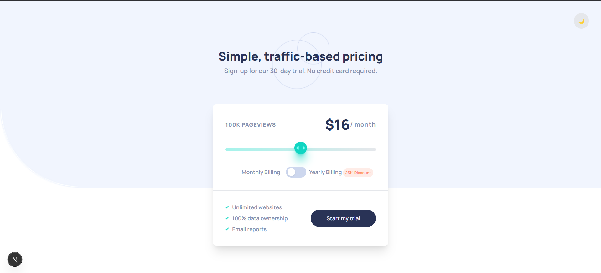
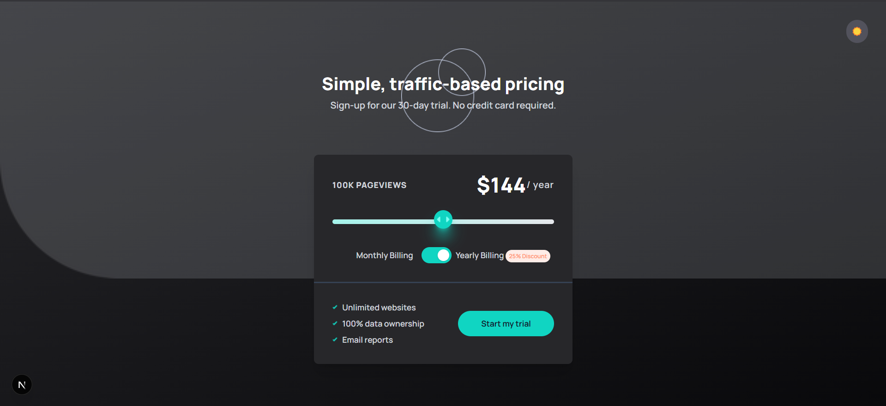

# Interactive pricing component 
### Assignment for Frontend Developer Intern at 'Invsto'
 [Interactive pricing component | Frontend Mentor](https://www.frontendmentor.io/challenges/interactive-pricing-component-t0m8PIyY8)


> Desktop Preview (Light Mode)

>
> Desktop Preview (Dark Mode)
 
 
>Mobile Preview (Light Mode)
>

>Mobile Preview (Dark Mode)
>


### Run On Local Machine 
1. To clone The repo :
``` git clone https://github.com/iamtanishqsethi/interactive-pricing-card-assignment```
2. ```cd interactive-pricing-card-assignment```

3. Install Dependencies ``` npm i```

4. Run Development Server ``` npm run dev  ```


